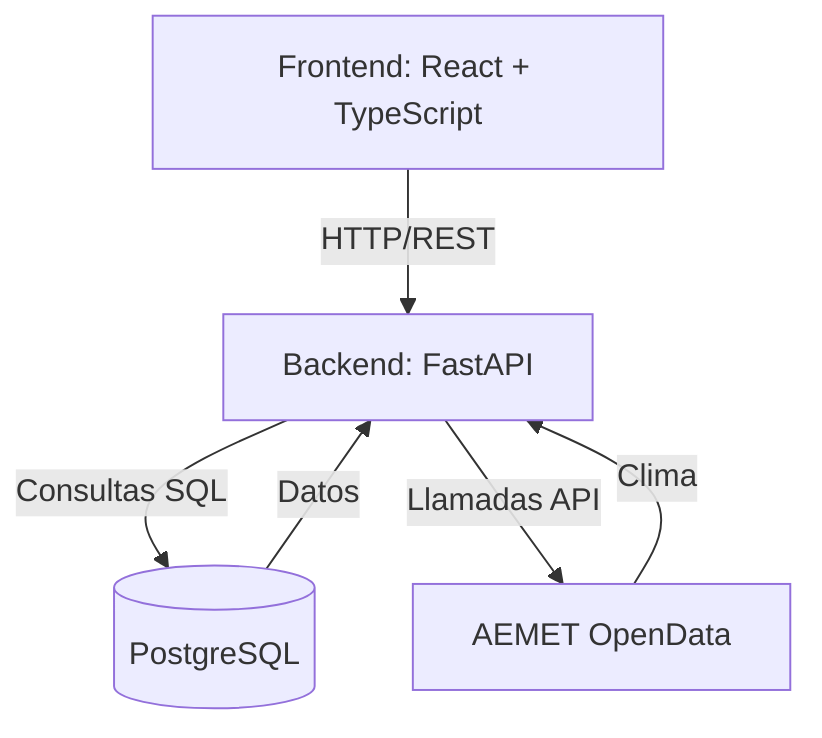

# Diagrama de Arquitectura

## Descripción
- **Frontend**: Aplicación web en React + TypeScript (en desarrollo futuro).
- **Backend**: API REST con FastAPI (Python) que gestiona la lógica de negocio.
- **Base de Datos**: PostgreSQL para almacenar datos de cajones, cultivos, asignaciones, etc.
- **API Externa**: AEMET OpenData para obtener datos climáticos (temperatura, humedad, viento, etc.).

## Flujo de Datos
1. El frontend envía solicitudes HTTP al backend.
2. El backend procesa las solicitudes, interactúa con PostgreSQL y/o AEMET.
3. El backend devuelve respuestas en formato JSON al frontend.
