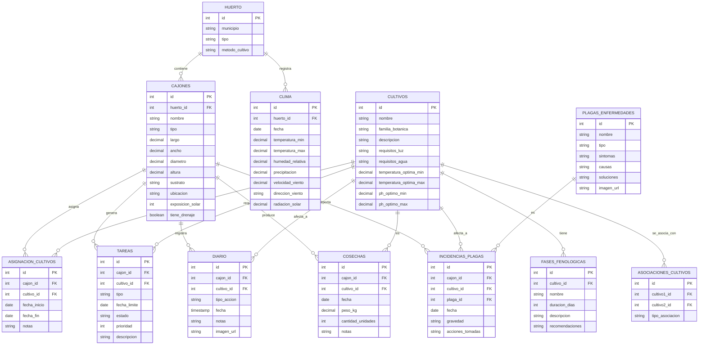

# Diagrama Entidad-Relación

## Notas
- **Relaciones**:
  - Un **Huerto** tiene múltiples **Cajones**. 
  - Un **Cajón** puede tener múltiples **Asignaciones de Cultivos** a lo largo del tiempo.
  - Un **Cultivo** tiene múltiples **Fases Fenológicas**.
  - Las **Tareas** y **Acciones del Diario** se asocian a un **Cajón** y/o **Cultivo**. 
  - Las **Incidencias de Plagas** se registran por **Cajón** y **Cultivo**. 

- **Tablas implementadas en el MVP**:
  - `HUERTO`, `CAJONES`, `CULTIVOS`, `ASIGNACION_CULTIVOS`.
- **Tablas pendientes para futuras fases**:
  - `FASES_FENOLOGICAS`, `TAREAS`, `DIARIO`, `COSECHAS`, `CLIMA`, `PLAGAS_ENFERMEDADES`, `INCIDENCIAS_PLAGAS`, `ASOCIACIONES_CULTIVOS`.
